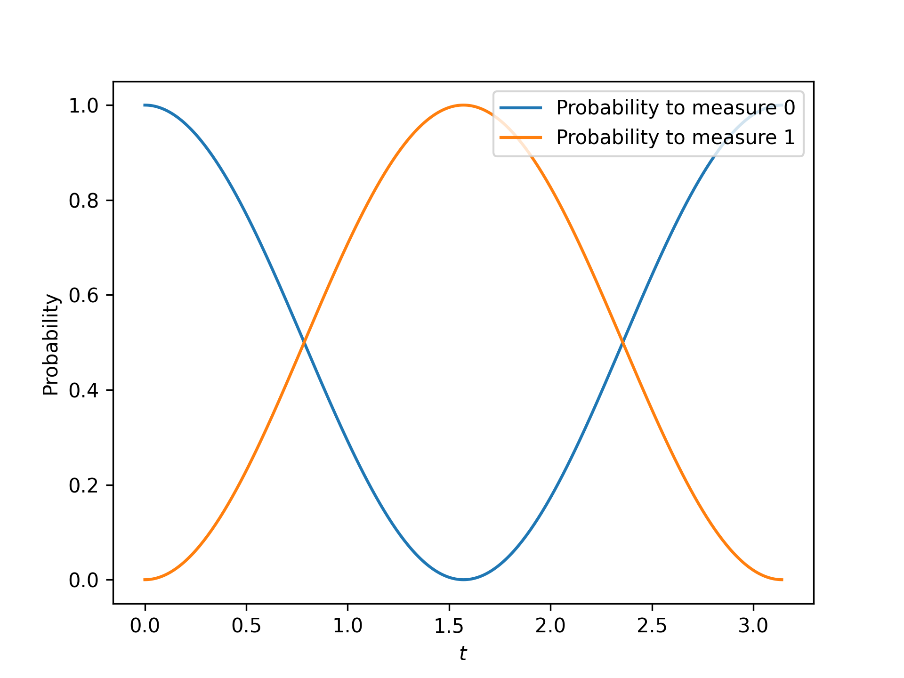

*********************
Introductory Examples
*********************

We can introduce several core ideas of
``unitair`` with simple physically motivated examples involving one qubit.

Initializing a State
====================

We start by creating an initial state for only one qubit. One
qubit has a two-dimensional complex Hilbert space of states,
and we can write its basis vectors as

.. math::

    \ket{0} =& \left(\begin{array}{c} 1\\ 0 \end{array}\right)\\
    \ket{1} =& \left(\begin{array}{c} 0\\ 1 \end{array}\right)

With PyTorch, we encode these states with tensors of size (2,):

.. code-block:: python

    # No need to import unitair!
    import torch

    ket_0 = torch.tensor([1.+0.j, 0.+0.j])

    ket_1 = torch.tensor([0.+0.j, 1.+0.j])

If you happen to be new to quantum mechanics, the use
of complex data types may surprise you. The first
"sentence" of quantum mechanics is that states of
physical systems are points in a complex Hilbert space,
and we therefore need complex numbers.

As another example, the state

.. math::

    \frac{1}{\sqrt{2}} \left( -i\ket{0} + \ket{1} \right)

corresponds to the ``Tensor``

.. code-block:: python

    torch.tensor([0.-0.7071j, 0.7071+0.j])

.. tip::

    Computational basis vectors like :math:`\ket{0}`
    can be obtained easily with ``unitair.initializations.unit_vector``.
    For example, ``unit_vector(0, num_qubits=1)`` produces :math:`\ket{0}`.

Operating on a State
====================

Consider an operator that acts on one qubit in the computational basis
according to the matrix

.. math::
    Q = \left(\begin{array}{cc}
    1 & 5-i\\
    5+i & -1
    \end{array}\right)

Unitair expects such a matrix to be encoded in the obvious way:

.. code-block:: python
    :name: q-matrix

    q = torch.tensor([[ 1.+0.j,  5.-1.j],
                      [ 5.+1.j, -1.+0.j]])

The ``Tensor`` ``q`` has size (2, 2), but it's helpful to think of
this size as :math:`(2^1, 2^1)` where the 1's are because
the operator can act on one qubit. A five-qubit operator would have
size :math:`(2^5, 2^5) = (32, 32)`.

.. tip::

    Because Unitair uses the obvious for matrices, you can
    use ``torch.matmul`` for matrix multiplication and ``torch.adjoint``
    for hermitian conjugates.

We can apply the operator :math:`Q` to the state :math:`\ket{0}`:

.. math::

    Q\ket{0}
    &=\left(\begin{array}{cc}
        1 & 5-i\\
        5+i & -1
    \end{array}\right)\left(\begin{array}{c}
        1\\
        0
    \end{array}\right)\\
    &=\left(\begin{array}{c}
        1\\
        5+i
    \end{array}\right)

To perform this operation with Unitair, we use the function
``apply_operator``:

.. code-block:: python

    from unitair.simulation import apply_operator

    # q and ket_0 already defined as above
    new_state = apply_operator(
        operator=q,
        qubits=(0,),
        state=ket_0
    )

.. code-block:: python
    :caption: Interactive Interpreter

    >>> new_state
    tensor([1.+0.j, 5.+1.j])

This is indeed the correct state :math:`\ket{0} + (5+i)\ket{1}`.

Operating on Batches of States
==============================

What if we wanted to compute the action of :math:`Q` on
both :math:`\ket{0}` and :math:`\ket{1}`? We could
use ``apply_operator`` twice, but that fails to take
advantage of vectorization, the C backend of PyTorch
and, if available, CUDA.

What we want is to operate on a *batch* of two states:
``ket_0`` and ``ket_1``. This is done by creating
the tensor ``torch.stack([ket_0, ket_1])`` which is the same as

.. code-block:: python

    state_batch = torch.tensor([[1.+0.j, 0.+0.j],
                                [0.+0.j, 1.+0.j]])

This state has size :math:`(2, 2)`. The repeated 2's just a coincidence
of course--the size is ``(batch_length, hilbert_space_dimension)`` where
``hilbert_space_dimension`` is :math:`2^n` for :math:`n` qubits. In fact,
an arbitrary number of batch dimensions is allowed
so the most general size for a quantum state is

.. code-block:: python

    (*optional_batch_dimensions, hilbert_space_dimension)

All Unitair functionality is built to understand that
states are formatted with this structure; deviating from it
is more likely to raise errors than to give incorrect results, but
the user is expected to be careful to conform to the convention.

.. note::

    Having to remember the conventions for shapes of states in Unitair
    may seem frustrating. A ``QuantumState`` class would
    eliminate this issue, but it would come with other costs.
    Sticking with a plain ``Tensor`` means that PyTorch functionality
    can be used without the burden of converting between types and
    it makes Unitair much easier to learn for PyTorch users. It also
    makes it easier to integrate Unitair into existing
    software designed with PyTorch.

Now let's apply :math:`Q` to both :math:`\ket{0}` and :math:`\ket{1}`:

.. code-block:: python

    # q and state_batch already defined as above
    new_state = apply_operator(
        operator=q,
        qubits=(0,),
        state=state_batch
    )

.. code-block:: python
    :caption: Interactive Interpreter

    >>> new_state_batch
    tensor([[ 1.+0.j,  5.+1.j],
            [ 5.-1.j, -1.+0.j]])

The result is a new batch of states with the expected structure. The first
batch entry is :math:`Q \ket{0}` and the second is :math:`Q \ket{1}`.
Although this example is trivial, it's important to not underestimate
the benefits of batching. Running ``apply_operator`` with a batch
of states can be thousands of times faster than running it repeatedly
in a loop, even on a CPU.

Batched Operations on a State
=============================

Batching is a fundamental concept for NumPy and PyTorch and indeed
it is central to Unitair. Not only can one operator act on many states,
but we can have many operators act on one state. (And in fact, we can
also have a collection of operators act on a collection of states in
one-to-one correspondence.)

.. note::

    When we talk about a batch of operators acting on a state,
    we mean obtaining the results of operating
    with each individual operator on the *same* initial state
    in "parallel", not in "sequence". We are not constructing
    a circuit by composing operators.

When we
:ref:`constructed the matrix<q-matrix>` :math:`Q` as
a ``Tensor``, it had size :math:`(2, 2) = (2^k, 2^k)` where :math:`k=1` is
the number of qubits on which :math:`Q` acts.

To create a batch of operators, we just add an additional dimension
on the left:

.. code-block:: none
    :caption: Operator size (one batch dimension)
    :name: op-size-one-batch-dim

    (
        batch_length,
        2^k, (Matrix rows)
        2^k, (Matrix columns)
    )

Now let's create a batch of operators. Given a real number :math:`t`,
consider the operator

.. math::
    U(t) = \left(\begin{array}{cc}
    \cos t & -i \sin t \\
    -i \sin t & \cos t
    \end{array}\right)

If you have a background in quantum mechanics, you may recognize
this operator as a spin 1/2 rotation about
the :math:`x`-axis by angle :math:`2t`. Regardless, note that :math:`U(t)`
can be written as

.. math::

    U(t) &= \cos (t) - i \sin (t) \, X \\
        &= e^{-i t X}

where :math:`X` is the Pauli operator

.. math::
    X = \left(\begin{array}{cc}
    0 & 1 \\
    1  & 0
    \end{array}\right)

and we use the matrix exponential function.

Unitair allows
us to construct :math:`e^{-i t X}` very easily:

.. code-block:: python
    :caption: Interactive Interpreter

    >>> from unitair.gates import exp_x
    >>> exp_x(.5)
    tensor([[0.8776-0.0000j, -0.0000-0.4794j],
            [-0.0000-0.4794j, 0.8776-0.0000j]])

You can confirm that this operation is as expected.

Now what if we want to consider a batch of different parameters :math:`t`?

.. code-block:: python

    import torch
    from math import pi
    from unitair.gates import exp_x

    # Create t = torch.tensor([0, .01, .02, ..., approximately pi])
    t = torch.arange(0, pi, .01)
    gate_batch = exp_x(t)

.. code-block:: python
    :caption: Interactive Interpreter

    >>> gate_batch.size()
    torch.Size([315, 2, 2])

    >>> gate_batch[0]
    tensor([[1.+0.j, 0.+0.j],
            [0.+0.j, 1.+0.j]])

    >>> gate_batch[1]
    tensor([[0.9999-0.0000j, 0.0000-0.0100j],
            [0.0000-0.0100j, 0.9999-0.0000j]])

Let's now apply *all* of these operators to :math:`\ket{0}`:

.. code-block:: python

    # gate_batch and ket_0 already defined as above
    states = apply_operator(
        operator=gate_batch,
        qubits=(0,),
        state=ket_0
    )

.. code-block:: python
    :caption: Interactive Interpreter

    >>> states.size()
    torch.Size([315, 2])

    # The first 5 states rotated away from |0>
    >>> states[:5]
    tensor([[1.0000+0.0000j, 0.0000+0.0000j],
            [0.9999+0.0000j, 0.0000-0.0100j],
            [0.9998+0.0000j, 0.0000-0.0200j],
            [0.9996+0.0000j, 0.0000-0.0300j],
            [0.9992+0.0000j, 0.0000-0.0400j]])

    # The last state is *almost* rotated by 360 degrees and returns to -|0>
    # rather than |0>, a famous property of half-integer spin particles:
    >>> states[-1]
    tensor([-1.0000+0.0000j,  0.0000-0.0016j])

We can ask Unitair about the probabilities of
measuring :math:`\ket{0}` and :math:`\ket{1}`:

.. code-block:: python

    from unitair.states import abs_squared

    # states defined above
    probabilities = abs_squared(states)

``probabilities`` is a ``Tensor`` with size ``(batch_length, 2)`` where
the dimension with length 2 runs over the Hilbert space dimensions of
of the quantum states in the batch (which is 2 because there is one qubit).
:ref:`Plots<simple_probabilities>` of ``probabilities[:, 0]`` and ``probabilities[:, 1]`` are
shown below.

    Probabilities of measuring 0 and 1 when the state
    :math:`\ket{0}` is evolved by :math:`e^{-iXt}` for
    various values of :math:`t`. The important Unitair concept
    is that we performed evolution by starting with a *batch of
    operators* :math:`\left(e^{-iX \cdot 0}, e^{-iX \delta t}, \ldots \right)`
    and we applied the batch to the initial state :math:`\ket{0}`.
